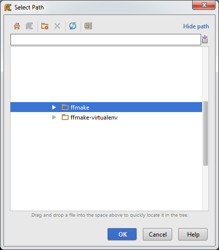
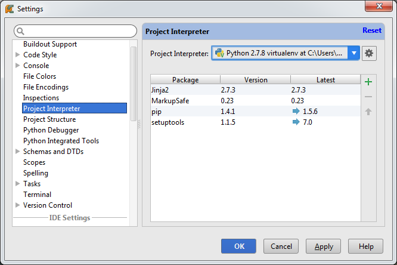

Working on ffmake with PyCharm
==============================

To open the ffmake project using PyCharm, select the Open Directory option on the
start dialog.

.. image:: pycharm-1.png

Select the cloned ffmake directory and click OK.
PyCharm should automatically import and index the source.

Make sure that you have a virtualenv set up in the PyCharm File -> Settings -> Project Interpreter
that contains the Jinja2 Python package.

